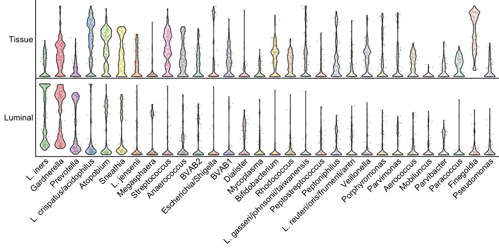

Suppl. Figure 1. Bacterial abundance across datasets
================


``` r
##################
# LOAD LIBRARIES #
##################
suppressWarnings({suppressMessages({suppressPackageStartupMessages({
  #remotes::install_github("czarnewski/niceRplots",force=T)
  library(niceRplots)
  library(tidyverse)
})  })  })

#############
# LODA DATA #
#############
datasets_all_samples <- readRDS("/Users/vilkal/work/Brolidens_work/Projects/Gabriella_repo/results/datasets_all_samples.RDS")
datasets_all_samples_ <- readRDS("../../results/03_normalize_data_output/datasets_all_samples.RDS")

#################
# COLOR PALETTS #
#################
Set1 <- c("#4DAF4A", "#E41A1C", "#984EA3", "#377EB8","#A6D854", "#FFFF33", "#FF7F00", "#A65628", "#F781BF", "#999999")
pal <- c(Set1,RColorBrewer::brewer.pal(8,"Set2"),
         RColorBrewer::brewer.pal(9,"Pastel1"),RColorBrewer::brewer.pal(8,"Pastel2")) #color pallete for plots
```

### Violin plot

``` r
x <- datasets_all_samples_[[1]]
top <- t(t(2^x-1)/colSums(2^x-1)) %>%
  as_tibble(., rownames ="tax") %>%
  pivot_longer(cols = -tax, names_to = 'ID') %>%
  group_by(tax) %>%
  summarise(mean = mean(value)) %>% 
  arrange(desc(mean)) %>%
  filter(!(tax == "Not assigned")) %>%
  pluck(., "tax") %>%
  .[1:30]

Lum <- datasets_all_samples_[[1]][rownames(datasets_all_samples_[[1]])%in%top,]
Tis <- datasets_all_samples_[[2]][rownames(datasets_all_samples_[[1]])%in%top,]

x_Lum <- Lum %>% as_tibble(., rownames ="tax") %>%
  pivot_longer(cols = -tax, names_to = 'ID') #%>% 
  #pivot_wider(names_from = tax, values_from = value)

x_Tis <- Tis %>% as_tibble(., rownames ="tax") %>%
  pivot_longer(cols = -tax, names_to = 'ID') #%>% 
  #pivot_wider(names_from = tax, values_from = value)

xx <- x_Lum %>% left_join(x_Tis, by=c("tax","ID")) %>% select(-ID)
xx_ <- xx %>% filter(!(is.na(.$value.y))) # filter out NA from Tissue

Luminal <- set_names(xx$value.x, xx$tax)
Tissue <- set_names(xx_$value.y, xx_$tax) 

t <- rbind(Tissue, Luminal)
```

    ## Warning in rbind(Tissue, Luminal): number of columns of result is not a multiple
    ## of vector length (arg 1)

``` r
###################################
# BACTERIAL ABUNDANCE IN DATASETS #
###################################
par(mar=c(6.5,2.5,0,0)) #b,l,t,r
violist(data = t, smooth = .1,
        genes = c("Tissue", "Luminal"),
        clustering = factor( colnames(t),levels = top),
        srt=45, cex.axis=0.7, pt.cex=0.2,
        transparency = 50,col = pal)
```



**Supplementary Figure 1. Abundance distribution of individual taxa in
the luminal and tissue microbiome data sets.** Violin plots showing the
distribution of relative abundance of the top 30 most abundant taxa in
the luminal and tissue-adherent data sets.
