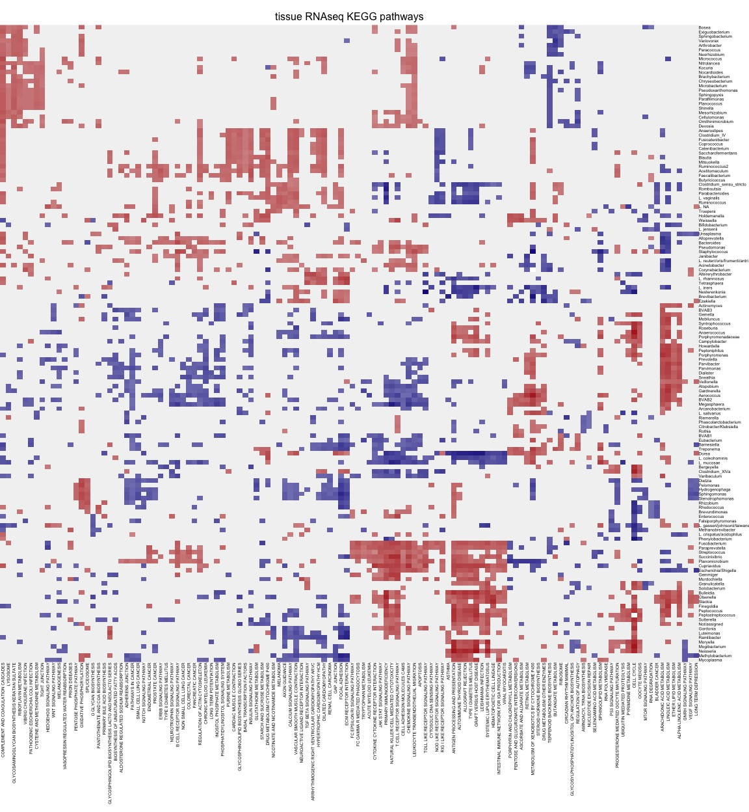
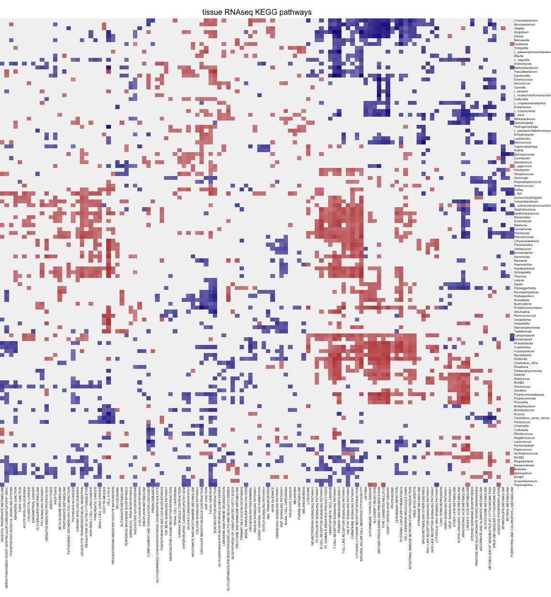

Suppl. Figure 4. & 5. Mirobiome-KEGG correlations.
================


``` r
##################
# LOAD LIBRARIES #
##################
suppressWarnings({suppressMessages({suppressPackageStartupMessages({
  library(tidyverse)
  library(openxlsx)
  library(fgsea)
  library(rafalib)
  library(Rcpp)
  library(igraph)
  #remotes::install_github("czarnewski/niceRplots",force=T)
  library(niceRplots)
  library(parallel)
})  })  })

#########
# PATHS #
#########
PATH <- "../../.."
reprod_files <- "../../data/reprod.Suppl.Fig.4_5/"

#############
# LODA DATA #
#############
datasets_all_samples <- readRDS("../../results/03_normalize_data_output/datasets_all_samples.RDS")
SNN_bacteria <- read.csv("../../results/04_clustering_output/bacteria_SNN_graph.csv",row.names = 1)
bac_communities <- read.xlsx("./Suppl.Tbl/Suppl.Tbl.01.xlsx", sheet = "Bacterial Communities")
```

### Correlation heatmap

``` r
myletter <- letters
#reprod. <- FALSE
reprod. <- TRUE

ASV <- list(c("Luminal","ASV_Luminal_normalized"),
            c("Tissue","ASV_Tissue_normalized")
            )
# i <- ASV[[1]]
for(i in ASV){
  cat(paste0("Correlation between RNAseq and ",i[1], " 16S","\n"))
  
  # because hclust is non reproducible 
  if(reprod. == TRUE){
    NESes <- read.csv2(paste0(reprod_files,i[1],"_TRX_Bact_norm_enrichment_scores",".csv"), row.names = 1)
  }else{
    
    TRX <- datasets_all_samples[["Tissue_RNAseq_V3_normalized"]]
    bac_dataset <- datasets_all_samples[[i[2]]]
    samples_TRX_and_CVL3 <- colnames(counts) [ colSums(counts[c("Tissue_RNAseq_V3_normalized",i[2]),] > 0)==2 ]
    
    #filter TRX dataset
    TRX <- TRX [ , samples_TRX_and_CVL3 ]
    TRX <- TRX [ rowSums(TRX>0)>= 2 , ]
    # only top 5000 most variabe genes are included in the correlation
    top_vars_TRX <- names(sort(apply(TRX,1,var),decreasing = T)[1:5000] )
    TRX <- TRX[ top_vars_TRX , ]
    dim(TRX)
  
    #filter bac_dataset dataset
    bac_dataset <- bac_dataset [ , samples_TRX_and_CVL3 ]
    # keeping taxa that is present in at least two samples :
    bac_dataset <- bac_dataset [ rowSums(bac_dataset>0)>= 2 , ]
    top_vars_bacs <- names(sort(apply(bac_dataset,1,var),decreasing = T)[1:100] )
    dim(bac_dataset)
    
    cors <- cor( t(rbind(TRX) ) ,  t(rbind(bac_dataset) ) )
    
    bacteria_use <- colnames(cors)
    gmt <- gmtPathways(paste0(PATH, "/supplementary_files/c2.cp.kegg.v6.2.symbols.gmt.txt"))
    
    enrichments <- lapply(bacteria_use,gmt=gmt,cors=cors,function(x,gmt,cors){
      res <- fgsea(pathways = gmt,stats = sort(cors[,x],decreasing = T),nper=10000)
      return(res)
    })
    names(enrichments) <- bacteria_use
    
    pvalues <- lapply(enrichments,function(x) setNames(x$pval,x$pathway) )
    pvalues <- t(as.data.frame(pvalues))
    pvalues <- -log10( pvalues )
    top_pathways <- names(sort(apply(pvalues,1,median),T))[1:50]  

    NESes <- lapply(enrichments,function(x) setNames(x$NES,x$pathway) )
    NESes <- t(as.data.frame(NESes))
    NESes[is.na(NESes)] <- 0
    # replace all NESes values with 0 if they don't have a significant p-value < 0.05:
    NESes[ pvalues < -log10(0.05) ] <- 0 
    # filter out bacterium and pathways with <10 significant NES scores 
    NESes <- NESes[rowSums(NESes!=0) >= 10 , colSums(NESes!=0) >= 10]
    
    set.seed(1)
    o_kegg <- hclust( as.dist( (1-cor(NESes))/2 ),"ward.D2")$order
    o_bacs <- hclust( as.dist( (1-cor(t(NESes) ))/2 ),"ward.D2")$order
    NESes <- NESes[o_bacs, o_kegg]
    
    bact <- gsub("\\.{1}", "/", rownames(NESes))
    bact <- gsub("\\/{2}", ". ", bact)
    rownames(NESes) <- bact
  
    #write.csv2(NESes, paste0("../../../results/",i[1],"_TRX_Bact_norm_enrichment_scores",".csv"))
  
  }
  
  terms <- gsub("_", " ", colnames(NESes))
  terms <- gsub("(GO |KEGG )", "", terms, perl = TRUE)
  colnames(NESes) <- terms
  
  ### Suppl. Figure 4-5
  #######################################
  # FUNCTIONAL ASSOCIATION BACT AND TRX #
  #######################################
  par(mfrow=c(1,1),mar=c(12,0,2,4)) #b,l,t,r
  image( t(NESes[nrow(NESes):1,]),col=colorRampPalette(c("navy","grey95","firebrick"))(91),breaks=seq(-3,3,length.out = 92),
         axes=F,border=NA,main="tissue RNAseq KEGG pathways",xlab="",ylab=i,line=.4,cex.main=1,font.main=1)
  text(  par("usr")[c(4)] , seq(1,0,length.out = nrow(NESes)),
        labels = rownames(NESes), srt = 0, adj = c(0,.5), xpd = TRUE, cex=.4)
  text( seq(0,1,length.out = ncol(NESes)) , par("usr")[c(1)],
        labels = colnames(NESes), srt = 90, adj = c(1,.5), xpd = TRUE, cex=.4)
  
}
```

    ## Correlation between RNAseq and Luminal 16S



    ## Correlation between RNAseq and Tissue 16S



**Suppl. Figure 4-5. Functional associations of the luminal microbiome
with host tissue gene expression profiles.** Bacterial abundances in the
luminal samples were correlated with gene expression of the top 5,000
highly variable genes from the RNAseq dataset. This generated a
correlation matrix between bacteria and genes. For each bacteria, genes
were ranked based on their correlation to that bacteria, followed by
gene set enrichment anlaysis (GSEA) using the KEGG gene annotation
database. The resulting matrix display associations between individual
bacterial taxa and corresponding KEGG term as defined in the host tissue
sample. The heatmap shows the normalized enrichment score (NES). Only
enrichments with p-value \< 0.05 are shown. Bacterium and pathways with
less than 10 significant NES scores were omitted from the heatmap.
Bacteria are grouped according to anatomical/functional activity and
marked with different colours per category.
