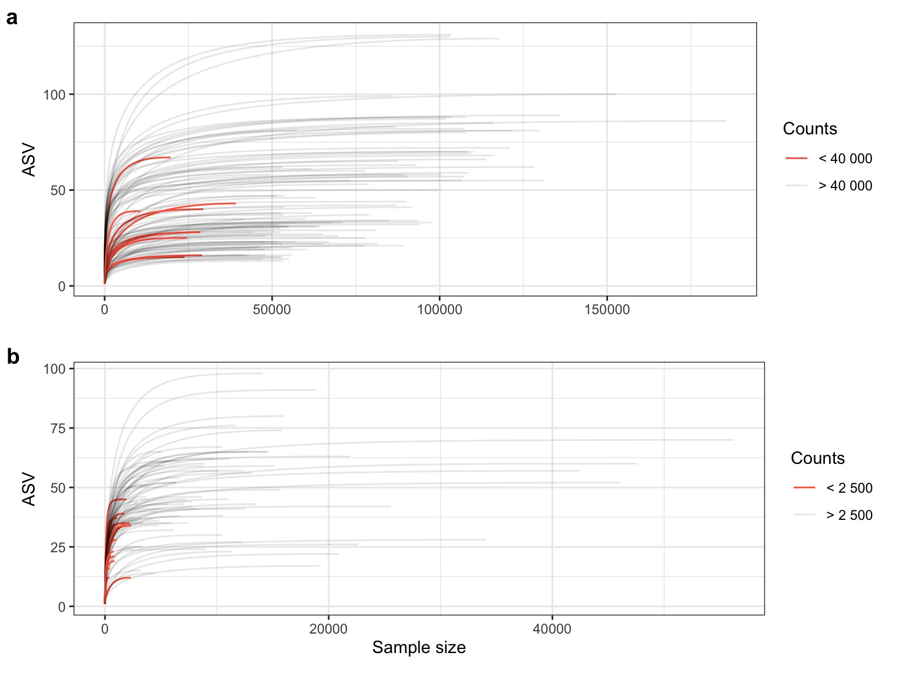

Suppl. Figure 6. Rarefaction curves
================


``` r
##################
# FILTER SAMPLES #
##################
# remove controls and duplicates
# Include column keeps replicate samples
# Include_final column removes all replicates and women that don't have trx samples
ps_filt <- map(ps_list, ~ .x %>%
  subset_samples(., Include_final == "yes")) 

# separate tissue from CVLv2 samples in the second Boston run
CVLv3 <- ps_filt[["boston_r1"]] %>% subset_samples(., Sample_type == "CVL" & Visit == "v3")
CVLv2 <- ps_filt[["boston_r2"]] %>% subset_samples(., Sample_type == "CVL" & Visit == "v2")
tissue <- ps_filt[["boston_r2"]] %>% subset_samples(., Sample_type == "tissue" & Visit == "v3")

# merge the lists
ps_types <- c(ps_filt, "CVLv3"=CVLv3, "CVLv2"=CVLv2, "tissue"=tissue)
# Get ASV tables
seqtabs <- map(ps_types, ~data.frame(.x@otu_table@.Data))

#######################
# RAREFACTION CURVES #
######################

# Get rarefaction curves
rare_runs <- map(seqtabs, ~ .x %>%
             rarecurve(., step = 20, label = FALSE)
)
```


``` r
ggplot_df_fun <- function(rare_obj, count) {
  # Add sample names
  names(rare_obj) <- c(paste0("sample",sprintf("%03.0f", 1:length(rare_obj))))

  # Coerce data into "long" form.
  rare_df <- imap_dfr(rare_obj, ~ .x %>%
              as_tibble(., rownames = "Sample size") %>%
              mutate(Sample = .y) %>%
              mutate(`Sample size` = as.numeric(gsub("N","",`Sample size`)))
  )
  # Get nr. of counts in each sample
  c <- formatC(count, format="f", big.mark = " ", digits=0)
  rare_df_col <- rare_df %>%
    dplyr::rename(ASV = "value") %>%
    group_by(Sample) %>%
    nest() %>%
    mutate(Counts = map(data, ~max(.$`Sample size`))) %>%
    unnest(c(data, Counts)) %>%
    mutate(Counts_ = Counts) %>%
    mutate(Counts = ifelse(Counts > count, paste0("> ", c), paste0("< ", c)))

  return(rare_df_col)
}

# Define some plot variables
count <- c(33000, 10000, 33000, 40000, 20000, 2500)
limit <- c(65000, 65000, 65000, 65000, 65000, 10000)
title <- c("Run B1. CVLv3 + CVLv2 rep.", "Run B2. CVLv2 + TISSUEv3",
           "Run Sthlm CVLv2", "Run B1. CVLv3", "Run B2. CVLv2", "Run B2. TISSUEv3")
title <- c("Run CVL", "Run B2. CVLv2 + TISSUEv3","Run Sthlm CVLv2", "Run B2. CVLv2", "Run Tissue")

# Extract data frame from the rarecurve object
rare_df_col<- map2(rare_runs, count, ~ggplot_df_fun(.x, .y))
# Create Plot
rare_plot <- map(rare_df_col,
              ~ggplot(.x, aes(x = `Sample size`, y = ASV)) +
              theme_bw() +
              scale_color_manual(values=c('tomato', alpha('black', 0.1))) +
              geom_line(aes(color = Counts, group = Sample)) +
              theme(plot.title = element_text(hjust = 0.5))
            )
raremax <- map(seqtabs, ~min(rowSums(.x)))

# sample information:
 read_counts <- map(rare_df_col, ~ .x %>%
            select(Sample, Counts, Counts_) %>%
            unique(.))

# Save png
#imap(r_plot, ~ggsave(filename = paste0('Rarefaction_plot_', .y, '.png'), plot = .x,
#        path = paste0("../../../results/"),
#        width = 10, height = 5,)
#)
```

### Rarefraction plot

``` r
### A & B
###########################
# RAREFRACTION CURVE PLOT #
###########################
plot <- ggarrange(
          #rare_plot[[1]] + theme(axis.title.x=element_blank(),plot.margin=unit(c(.5,.5,.5,.5),"cm")),
          #rare_plot[[3]] + theme(axis.title.x=element_blank()),
          rare_plot[[4]] + theme(axis.title.x=element_blank(), plot.margin=unit(c(.5,.5,.5,.5),"cm")),
          rare_plot[[6]] + theme(plot.margin=unit(c(.5,.5,.5,.5),"cm")),
          ncol = 1,
          labels = c("a","b","c","d")
          )
print(plot)
```



``` r
# ggsave(filename = paste0('Suppl.Figures6.pdf'), plot = plot,
#        path = paste0("./Suppl.Figures/"),
#        width = 8, height = 6
# )
```

**Supp. Figure 6. Rarefraction curves**. Rarefaction curves showing
number of unique ASVs detected in each sample when simulating increasing
sequencing depth. Low abundant taxa may be undetected at low sequencing
depth but are expected to be detected with an increased sequencing depth
(x-axis). When the curve flattens out, all taxa in the sample are
considered detected. **a)** The Luminal sequencing run and **b)** the
Tissue sequencing run. The sequencing depth was \> 40000 reads in all
but 9 samples for the Luminal dataset while 16 samples had fewer than
2500 reads in the tissue-adherent microbiome dataset.
