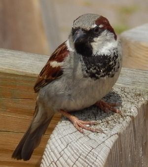

\footnotetext[1]{University of Nowhere}
\footnotetext[2]{University of Somewhere}
\footnotetext[3]{University of Lalaland}


```{r Setup..., message=FALSE, warning=FALSE, include=FALSE}
options(tinytex.verbose = TRUE)
knitr::opts_chunk$set(fig.pos = 'p') # Places figures on their own pages
knitr::opts_chunk$set(out.width = '100%', dpi=300)

# I usually load my libraries up front to keep things organized
library(bookdown)
library(knitr)
library(kableExtra)
library(ggplot2)
# library(ggthemes)
library(dplyr)
library(stringr)
remotes::install_github("czarnewski/niceRplots")
library(niceRplots)
```


Abstract
===============================================================================
  
Abstract Abstract Abstract Abstract Abstract Abstract Abstract Abstract Abstract Abstract Abstract Abstract Abstract Abstract Abstract Abstract Abstract Abstract Abstract Abstract Abstract Abstract Abstract Abstract Abstract Abstract Abstract Abstract Abstract Abstract Abstract Abstract Abstract Abstract Abstract Abstract Abstract Abstract Abstract Abstract Abstract Abstract Abstract Abstract Abstract Abstract Abstract Abstract Abstract Abstract Abstract Abstract Abstract Abstract Abstract Abstract Abstract Abstract Abstract Abstract Abstract Abstract Abstract Abstract Abstract Abstract Abstract Abstract Abstract Abstract Abstract Abstract Abstract Abstract Abstract Abstract Abstract Abstract Abstract Abstract Abstract Abstract Abstract Abstract Abstract Abstract Abstract Abstract Abstract Abstract Abstract Abstract Abstract Abstract Abstract Abstract Abstract Abstract Abstract Abstract Abstract Abstract Abstract Abstract Abstract Abstract Abstract Abstract Abstract Abstract Abstract Abstract Abstract Abstract Abstract Abstract Abstract Abstract Abstract Abstract Abstract Abstract Abstract Abstract Abstract Abstract Abstract Abstract Abstract Abstract Abstract Abstract Abstract Abstract Abstract Abstract Abstract Abstract Abstract Abstract Abstract Abstract Abstract Abstract Abstract Abstract Abstract Abstract Abstract Abstract Abstract Abstract Abstract Abstract Abstract Abstract Abstract Abstract Abstract Abstract Abstract Abstract Abstract Abstract Abstract Abstract Abstract Abstract Abstract Abstract Abstract Abstract Abstract Abstract Abstract Abstract 


\clearpage

Introduction
================================================================================

Introduction Introduction Introduction Introduction Introduction Introduction Introduction Introduction Introduction Introduction Introduction Introduction Introduction Introduction Introduction Introduction Introduction Introduction Introduction Introduction Introduction Introduction Introduction Introduction Introduction Introduction Introduction Introduction Introduction Introduction Introduction Introduction Introduction Introduction Introduction Introduction ([@Johnston1972]), Introduction Introduction Introduction Introduction Introduction Introduction Introduction Introduction Introduction Introduction Introduction Introduction Introduction Introduction Introduction Introduction Introduction Introduction Introduction Introduction Introduction Introduction Introduction Introduction Introduction **Introduction Introduction** *Introduction* Introduction ([@Darwin1859]^,^[@Bumpus1898]) .

Problem / question to answer

\clearpage


Results
===============================================================================

```{r, echo = FALSE, eval = TRUE}
metadata <- read.csv2("../../../results/metadata_integration.csv",row.names = 1)
patient_groups <- metadata$joint_clustering
bac_communities <- as.matrix(read.csv2("../../../results/bacterial_communities.csv",row.names = 1))[,1]
```

**Joint analysis of vaginal microbiome reveals XXXXXXXXXXXXXX**

To understand the longitudinal and tissue-specific microbiome profile in vaginal samples, `r nrow(metadata)` adult female sex workers were enrolled in [...]. Among those, `r sum(metadata$HIVstatus=="pos")` were previously tested positive for HIV during the cohort's sampling procedure. [Describe here what was done and when, which samples, which tissues]. 


To be able to better undertand the differences in microbiome profile across all datasets collected, we  performed a joint graph-based clustering analysis in order to identify co-regulated bacterial communities (see "Methods" section for details). A total of `r length(unique(bac_communities))` bacterial communities were identified.


Noticebly, bacterial community `r bac_communities["Lactobacillus iners"]` consisted only of Lactobacillus species (*`r names(bac_communities)[bac_communities %in% bac_communities["Lactobacillus iners"]]`*).


Patients were thus subdivided into `r length(unique(patient_groups))` groups,


\clearpage


Discussion
================================================================================

I have analysed data collected by Herman Bumpus [@Bumpus1898] on the relationship between sparrow (*Passer domesticus*) total length and surival following an unusually severe storm. I found that sparrows that died in the storm were longer than sparrows that survived, which suggests that higher sparrow body length decreased survival. Of course, it is not possible to definitively conclude a causal relationship between any aspect of body size and sparrow survival<!--- BD Note: maybe explain this better --->, and even the available data collected by Bumpus would permit a more thoughtful analysis than that conducted in this study (see [Appendix Table 1](#appendix)). 

<!---

Here is one way to add some more detailed comments into the manuscript itself, though this can also be done within the text (see above). 

--->

Overall, this document demonstrates how high quality, professional looking documents can be written using Rmarkdown. The [underlying code](https://github.com/StirlingCodingClub/Manuscripts_in_Rmarkdown/blob/master/ms.Rmd) for this manuscript is publicly available, along with [accompanying notes](https://stirlingcodingclub.github.io/Manuscripts_in_Rmarkdown/Rmarkdown_notes.html) to understand how it was written. By using Rmarkdown to write manuscripts, authors can more easily use version control (e.g., git) throughout the writing process. The ability to easily integrate citations though BibTeX, LaTeX tools, and dynamic R code can also make writing much more efficient and more enjoyable. Further, obtaining the benefits of using Rmarkdown does not need to come with the cost of isolating colleagues who prefer to work with Word or LaTeX because Rmarkdown can easily be converted to these formats (in the case of Word, with the push of a button). By learning all of the tools used in this manuscript, readers should have all of the necessary knowledge to get started writing and collaborating in Rmarkdown.


\clearpage


Methods
================================================================================

Bumpus focused his study on the House Sparrow (*Passer domesticus*; see Figure 1), which has a very wide global distribution. It is native to Europe and Asia, but not the Americas where Bumpus collected his original study [@Bumpus1898]. In addition to measuring total length and survival for 136 sparrows, Bumpus measured sparrow sex, wingspan, and mass, and also the length of each sparrow's head, humerus, tibiotarsus, skull, and sternum. While modern ornithologists believe that the total body length measurement that I will use today is subject to high observational error [@Johnston1972], it will be more than sufficient for demonstrating Rmarkdown.

<!--- Note that the image below is in the public domain --->
<!--- https://commons.wikimedia.org/wiki/File:Lto-tpbo-passer-domesticus-05.JPG --->
<center>



</center>

I performed an independent two-sample student's t-test on sparrow total body length to test whether or not sparrows that died in the 1898 storm were larger than sparrows that survived. I assume that both groups of sparrows (dead and living) have equal variances, so the test statistic $t$ is calculated as follows,

$$t = \frac{\bar{X}_{1} - \bar{X}_{2}} {s_{p} \times \sqrt{\frac{1}{n_{1}} + \frac{1}{n_{2}}}}.$$

In the above, $\bar{X}_{1}$ and $\bar{X}_{2}$ are the mean of the samples of sparrows that died and lived, respectively. Similarly, $n_{1}$ and $n_{2}$ are the sample sizes of sparrows that died and lived, and $s_{p}$ is the pooled sample mean, which is calculated as follows,

$$s_{p} = \sqrt{\frac{s^{2}_{X_{1}} + s^{2}_{X_{2}}}{2}}.$$

In the above, the $s^{2}_{X_{1}}$ and $s^{2}_{X_{2}}$ are the sample standard deviations for sparrows that died and lived, respectively. I conduceted the two sample t-test using the `t.test` function in R.


\clearpage

References
================================================================================

<div id="refs"></div>


\clearpage


<a name="appendix">Appendix Table 1</a>
================================================================================

An example table is shown below, which includes all of the variables collected by @Bumpus1898 for the first 10 measured sparrows. The full data set can be found online in [GitHub](https://github.com/StirlingCodingClub/Manuscripts_in_Rmarkdown/blob/master/data/Bumpus_data.csv).

```{r, echo = FALSE, fig.pos='H',fig.show='hold'}
library(knitr)
```


